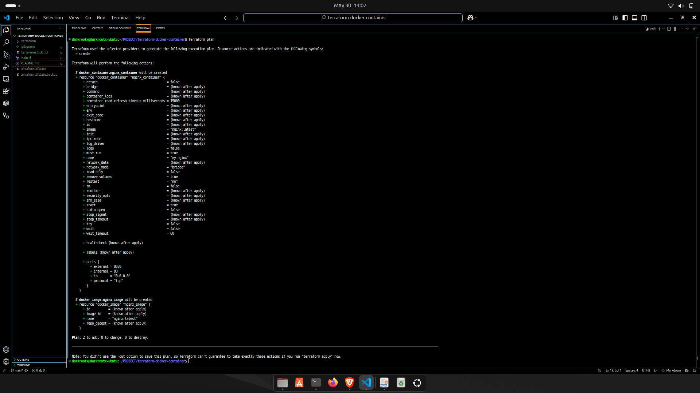
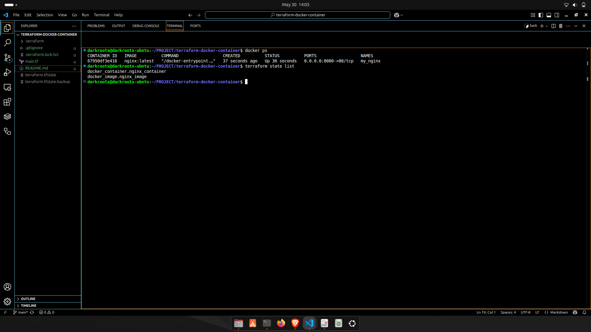
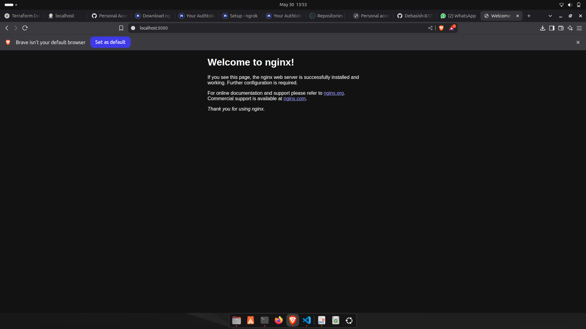

Here’s the final polished README with placeholders for your screenshots. Just replace the paths in `` with your actual screenshot image paths/names inside your repo folder (like `screenshots/terraform_plan.png`, etc.):

````markdown
# 🚀 Terraform Docker Container Provisioning

## 📋 Project Overview

This project demonstrates the power of **Infrastructure as Code (IaC)** by provisioning a local Docker container using **Terraform**.  
The objective is to automate the creation and management of a Dockerized Nginx web server container using declarative Terraform configurations.

---

## 🛠️ Tools & Technologies Used

| Tool      | Purpose                            |
| --------- | ---------------------------------- |
| Terraform | IaC tool to provision Docker infra |
| Docker    | Container runtime environment      |

---

## 🎯 Objective

- Write Terraform code to provision and manage Docker containers.
- Use the Docker provider in Terraform to create an Nginx container.
- Apply Terraform lifecycle commands (`init`, `plan`, `apply`, `destroy`) to manage infra.
- Understand Terraform state management.
- Gain hands-on experience with automated infrastructure provisioning.

---

## ⚙️ Setup & Execution

### Prerequisites

- Docker installed and running locally
- Terraform installed (v1.0+ recommended)

### Steps to run

1. **Initialize Terraform:**

   ```bash
   terraform init
````

2. **Review the execution plan:**

   ```bash
   terraform plan
   ```

3. **Apply the Terraform configuration:**

   ```bash
   terraform apply -auto-approve
   ```

4. **Verify the container is running:**

   ```bash
   docker ps
   ```

   You should see the `my_nginx` container running and mapping port 8080 to port 80 inside the container.

5. **Access the running Nginx container:**

   Open a browser and navigate to:
   `http://localhost:8080`
   You should see the default Nginx welcome page.

6. **Destroy the infrastructure when done:**

   ```bash
   terraform destroy -auto-approve
   ```

---

## 🔍 Terraform State Management

* **Check current Terraform state:**

  ```bash
  terraform state list
  ```

* **View detailed resource info:**

  ```bash
  terraform show
  ```

The Terraform state file (`terraform.tfstate`) tracks resource metadata and helps Terraform manage lifecycle operations efficiently.

---

## 📂 Project Structure

```
terraform-docker-container/
├── main.tf            # Terraform configuration file
├── terraform.tfstate  # Terraform state file (auto-generated)
└── README.md          # Project documentation
```

---

## 👩‍💻 Code Snippet (`main.tf`)

```hcl
provider "docker" {
  host = "unix:///var/run/docker.sock"
}

resource "docker_image" "nginx_image" {
  name = "nginx:latest"
}

resource "docker_container" "nginx_container" {
  name  = "my_nginx"
  image = docker_image.nginx_image.latest
  ports {
    internal = 80
    external = 8080
  }
}
```

---

## 🎓 Key Learnings

* Understanding **Infrastructure as Code (IaC)** principles.
* Practical experience with **Terraform providers** and resources.
* Working knowledge of Terraform commands and lifecycle.
* Managing Docker containers declaratively.
* Importance and usage of **Terraform state** in resource tracking.

---

## ❓ Interview Questions Related to This Task

1. **What is Infrastructure as Code (IaC)?**
   IaC is the process of managing and provisioning infrastructure through machine-readable configuration files rather than physical hardware or interactive configuration tools.

2. **How does Terraform work?**
   Terraform uses providers to interact with APIs of cloud or local infrastructure to create, update, or delete resources as defined in configuration files.

3. **What is the Terraform state file?**
   It is a JSON file that keeps track of the infrastructure resources Terraform manages, allowing it to map real-world resources to your configuration.

4. **Difference between `terraform plan` and `terraform apply`?**
   `plan` previews changes without applying; `apply` executes those changes to reach the desired state.

5. **What are Terraform providers?**
   Providers are plugins that enable Terraform to interact with different APIs like AWS, Docker, Azure, etc.

6. **What is resource dependency?**
   It is the order in which resources must be created or destroyed based on their relationships.

7. **How do you handle secret variables?**
   Using environment variables, `.tfvars` files excluded from version control, or secret management tools like Vault.

8. **Benefits of Terraform?**
   Declarative configs, version control, automation, multi-cloud support, and infrastructure consistency.

---

## 📸 Screenshots

### 1. Terraform Plan


*Preview of planned infrastructure changes.*

---

### 2. Terraform Apply


*Applying configuration to provision resources.*

---

### 3. Terraform State & Docker Container List


*Listing Terraform managed resources and running Docker containers.*

---

### 4. Nginx Running in Browser


*Nginx welcome page served on localhost:8080.*

---

### 5. Terraform Destroy


*Destroying all infrastructure resources.*

---

## 📂 GitHub Repository

[https://github.com/Debasish-87/terraform-docker-container](https://github.com/Debasish-87/terraform-docker-container)

---

## 🙏 Thank You!

Feel free to reach out for questions or collaboration.
Happy Infrastructure as Code provisioning! 🚀

```